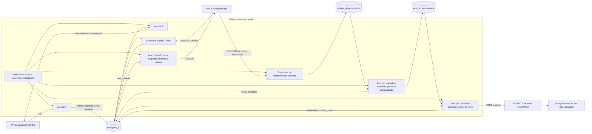
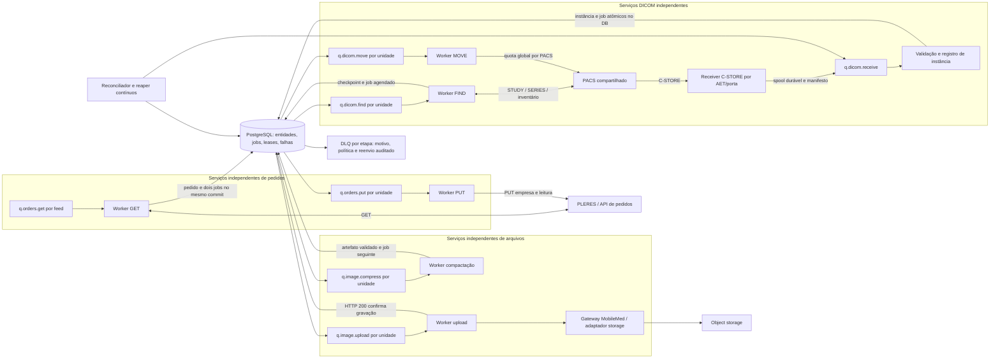
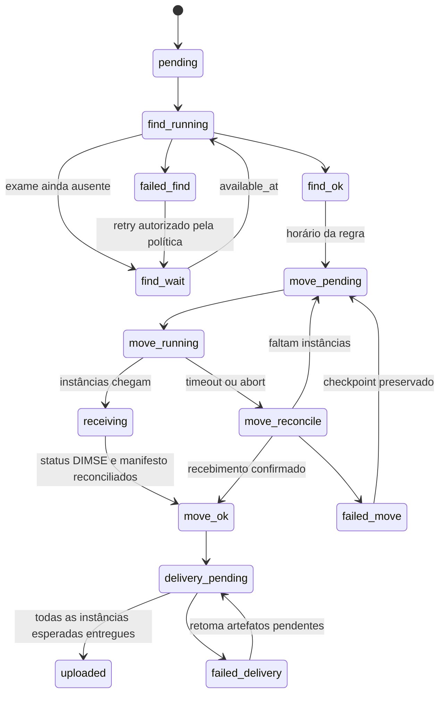
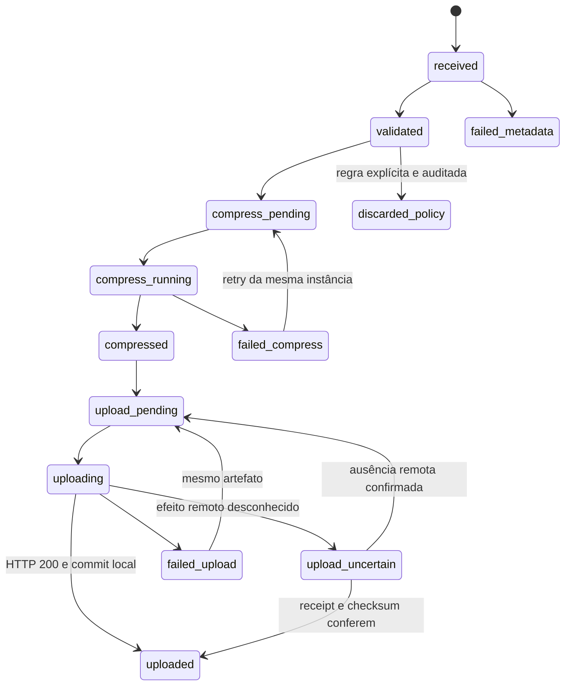

**MobileMed — diagnóstico do pipeline e arquitetura proposta**

Análise de 17/09/2026. Base: commit `8132fbb` e alterações locais de Empresa ID e diagnóstico da ingestão. Documento de projeto; os novos workers e o schema proposto ainda não foram implantados. As alterações anteriores foram preservadas.

**Atualização após a análise:** o usuário confirmou que HTTP 200 da API de envio só ocorre após gravação bem-sucedida no storage. Portanto, **200 → commit de uploaded → exclusão local**, sem confirmação remota adicional. A primeira implementação está descrita no [registro de implementação](C:/Users/lucas/Documents/retrieve-manager/docs/architecture/mobilemed-implementation.md); o mapa das seções 1–2 abaixo documenta o código anterior às correções dessa entrega.

Ambiente informado: AXIAL funciona com uma unidade; o site com problemas tem duas unidades, **6 núcleos, 14 GB de RAM e o mesmo PACS**, com Calling AETs diferentes. Não foram fornecidos volume de pico, tamanho das imagens, capacidade do link, limites de associações do PACS, planos de execução nem métricas do PostgreSQL de produção. Os números de capacidade abaixo são pontos de partida para medição, não um benchmark do site.

**1. Mapa honesto do fluxo atual**

O aplicativo possui paralelismo, mas ainda não possui isolamento de processos por etapa. O Compose sobe `web`, `postgres` e **um processo `app.worker`**, que controla pools de threads e subprocessos DCMTK. Web e worker têm engines SQLAlchemy separados; dentro do worker, as sessões das etapas usam o mesmo engine/pool. Não há broker externo nem tabela genérica de jobs duráveis.

O PUT e o C-FIND são consumidores independentes depois da persistência do pedido. Compactação e envio podem começar enquanto o C-MOVE ainda recebe imagens. **`Order.status=done` significa término do retrieve, não entrega de todas as imagens à nuvem.** O endpoint padrão é `https://idr.mobilemed.com.br/api/router/send-image`; não existe cliente S3/OCI neste caminho. Não foi possível identificar no repositório um contrato específico de AEyemed. O responsável confirmou posteriormente que o gateway só retorna HTTP 200 após gravar o arquivo; esse é o comprovante suficiente para o cliente.

| Etapa atual | Entrada → saída e dependência | I/O, transação, fila e concorrência | Falha no meio e recuperação atual |
|---|---|---|---|
| GET | URL/token da unidade → array JSON → `orders` e eventos | Consulta padrão a cada 30 s, timeout 60 s/tentativa, 3 tentativas HTTP; 4 threads de ingestão de unidades, uma tarefa ativa por unidade neste processo. Sem conexão DB durante GET. Depois, SELECT por accession, savepoint e flush por pedido; commit no fim do retorno inteiro. Filtro local `idPosto`; não filtra por dia. | Falha HTTP/JSON é logada e nova consulta vem depois. Pedido inválido é descartado desta consulta e não confirmado. Ainda não há caixa durável de rejeições. Uma queda antes do commit faz o lote precisar ser lido novamente. |
| PUT | Pedidos com `api_read_status=pending` → confirmação PLERES | Lote 32/unidade; até 8 HTTP simultâneos/unidade; pool 4 unidades. Usa token de integração e Empresa ID da unidade. A seleção não tem claim durável. Mantém a transação de leitura até chegar o primeiro resultado; commits individuais seguintes são síncronos dentro do loop async. | HTTP transitório tem 3 tentativas; falha permanece pending para o próximo ciclo, inclusive erros permanentes. Não há backoff persistente entre ciclos nem DLQ. Sucesso remoto seguido de queda antes do commit repete PUT. A idempotência remota precisa ser contratada. |
| C-FIND | Pedido `watching`, accession e nascimento → Study UID, modalidade, body part, datas de retrieve | Pool global 8, até 4 tarefas/unidade, scheduler a cada 5 s. Claim `FOR UPDATE SKIP LOCKED`, grava timestamps e commit antes do PACS. Faz consulta STUDY e geralmente outra SERIES, 20 s cada. Consulta regras entre elas e libera conexão antes da segunda. | Falha técnica volta a consultar no intervalo da unidade, padrão 30 s; sem jitter. Sem resultado não é erro: continua watching, arquivamento após 24 h sob as condições do código. Erro SQL ao persistir pode terminar em `error`. Sem lease/fencing de proprietário. |
| C-MOVE | Pedido vencido ou série histórica/manual → C-STORE para AET cadastrado | Pool global fixo 16. Limite `max_parallel_moves` por unidade, padrão 1, compartilhado entre atual, segundo, histórico e manual. Claims SQL curtos; C-MOVE automático/histórico liberam a conexão antes do subprocesso. **Manual mantém transação aberta durante a rede.** Tempos padrão: primeiro 600 s, segundo 900 s, histórico 1.800 s. | Automático: 3 tentativas com 60/300 s de espera. Histórico salva checkpoints por série; manual não tem a mesma política automática. Exit code orienta resultado; não há inventário de instâncias que prove estudo completo. |
| Recepção C-STORE | PACS → arquivos em `receive_dir` | `storescp --fork` por unidade, supervisionado pelo mesmo processo. Mesmo Calling AET é o destino esperado; portas e diretórios precisam ser exclusivos. A fila de entrada é o filesystem. | Subprocesso morto é reiniciado no próximo reconcile. Saída de storescp é drenada, mas só há cauda em memória; não existe confirmação durável por SOP no banco nesta etapa. Arquivos incompletos não têm protocolo explícito de publicação como completos. |
| Compactação | Arquivo recebido → regras/metadados → DICOM preparado/comprimido → `image_transfers` | Scans limitados a 250; idade do mtime ≥ espera, padrão 3 s. Pool por unidade, padrão 8; semáforo global 8. Regras carregadas e conexão liberada antes dos codecs. Timeout do codec 300 s; preparação Python e I/O de filesystem não têm deadline equivalente. Resultados persistidos em blocos de 25. | Arquivo temporário e `os.replace` protegem a publicação parcial do resultado, mas original é removido antes do commit de sua associação. Codec/parser falho vai para pasta de erro, sem retry uniforme. Falhas DB têm fallback/3 tentativas imediatas. Não há claim entre processos. |
| Upload | `image_transfers` compressed/upload_error + arquivo → HTTP multipart → uploaded | Lote 250; padrão 16 HTTP/unidade, teto global 32. Timeout HTTP total 120 s/conexão 10 s. Commit antes de I/O. `asyncio.gather` espera **todo o lote** antes de persistir resultados; persistência em blocos de 50. Não marca uploading com lease. | Aceita apenas HTTP 200; não verifica receipt, checksum nem objeto remoto. Falhas recebem backoff 10 s até 900 s, sem jitter e sem limite de tentativas. Circuito local por unidade abre após 5 lotes totalmente falhos, por 60 s. Confirma no DB antes de remover arquivo. Queda entre sucesso remoto e commit pode reenviar. |
| PostgreSQL/status | Transições de pedidos, imagens, histórico, regras e auditoria | Um pool por processo; worker sem configuração explícita de tamanho. Índices já existem por unidade/status/datas, study UID e transferências. Arquivamento lógico marca linhas nas mesmas tabelas. | Existe recuperação de locks por tempo, mas não um proprietário/versionamento de claim em todas as etapas. Não existe política uniforme para deadlock, indisponibilidade DB e transação de resultado rejeitada. |

As esperas de negócio devem ser preservadas: CT/MR têm primeiro retrieve após 15 min e segundo a partir do agendamento de 90 min; padrão das demais modalidades é 10 min, conforme regras cadastradas. Não confundir essa espera intencional com atraso de fila. O segundo retrieve é uma execução prevista, não uma duplicação acidental.

Evidências no código: [orquestração](C:/Users/lucas/Documents/retrieve-manager/app/worker.py:296), [ingestão e PUT](C:/Users/lucas/Documents/retrieve-manager/app/pipeline.py:290), [C-FIND](C:/Users/lucas/Documents/retrieve-manager/app/pipeline.py:704), [claims de MOVE](C:/Users/lucas/Documents/retrieve-manager/app/pipeline.py:1015), [manual](C:/Users/lucas/Documents/retrieve-manager/app/pipeline.py:1305), [compactação](C:/Users/lucas/Documents/retrieve-manager/app/pipeline.py:1950), [envio](C:/Users/lucas/Documents/retrieve-manager/app/pipeline.py:3004), [pool](C:/Users/lucas/Documents/retrieve-manager/app/db.py:58).

**2. Gargalos e riscos mais prováveis, em ordem de investigação**

| Prioridade | Evidência ou hipótese | Por que piora com duas unidades/alto volume | Como confirmar |
|---|---|---|---|
| P0: PACS compartilhado | Há limite por unidade, mas não orçamento compartilhado por PACS. Calling AET não isola CPU, discos nem licença de associações do PACS. | Os defaults permitem até 8 jobs C-FIND no site, além de C-MOVEs e dos FINDs históricos executados dentro dos jobs MOVE. | Associações por tipo/PACS, latência e status DIMSE, rejeições/aborts, C-FIND p95 e idade dos jobs; comparar uma unidade sozinha versus ambas. |
| P0: retenção de conexão | PUT até a primeira resposta e C-MOVE manual durante toda a rede mantêm transação aberta. Reproduzido localmente com Session SQLAlchemy e I/O simulado; automático não mantém. | Rede lenta passa a consumir conexões DB. Mais threads não corrigem a causa. | `pg_stat_activity`, idade de transação e checkout wait do pool, separados por etapa. |
| P0: carga CPU/IO | Compactação global padrão 8 para **6 núcleos**; padrão de upload agregado chega a 32. | Disputa por CPU, memória e disco com DB, receivers e leitura de arquivos. Cada unidade tenta drenar sua fila sem garantia explícita de fatia global. | CPU/run queue, throttling, RSS por subprocesso, iowait, latência disco e MB/s. Hipótese de saturação, não medição feita. |
| P0: claims incompletos | PUT, compactação e upload dependem de exclusão em memória; `COUNT` de MOVE não reserva atomicamente o limite por unidade. | Replicar o processo inteiro pode duplicar PUT/uploads, operar o mesmo arquivo, ultrapassar quota de MOVE e disputar a mesma porta storescp. | Testes com dois processos concorrentes e falhas injetadas; não escalar o monólito sem corrigir ownership. |
| P1: fim de lote | Upload aguarda todos os resultados de até 250 arquivos para registrar o primeiro sucesso. | Poucos arquivos lentos atrasam os commits, a limpeza e o lote seguinte. Aumenta a janela de reenvio após crash. | Comparar duração individual dos POSTs com tempo até persistir sucesso e duração do lote. |
| P1: escrita de pedidos | GET faz SELECT/savepoint/flush/eventos por pedido e um commit no final. | Grandes retornos geram muitas viagens ao banco e atrasam a visibilidade de todo o lote. Duas consultas ao mesmo feed podem duplicar tráfego e parsing. | Tamanho da resposta, duração GET versus ingestão, statements/pedido, WAL e p95 de commit. |
| P1: fila de filesystem | Mtime não prova fim da escrita; reconciliador de send só varre órfãos quando não há transferências elegíveis. | Arquivos ainda em escrita podem ir para erro; com fila continuamente ocupada, órfãos podem demorar indefinidamente a ser descobertos. | Arquivos sem registro, idade do órfão mais antigo, partial files, testes com C-STORE pausado. |
| P1: recuperação prematura | MOVE atual tem stale fixo de 20 min, sem heartbeat periódico; cadastro permite timeout até 7.200 s. | Uma operação legítima longa pode ser reclassificada como órfã e reclamada outra vez. Histórico/manual têm cálculo diferente. | MOVE >20 min com atualização concorrente do reaper; teste com relógio controlado. |
| P1: saúde enganosa | Arquivo de saúde é compartilhado; várias etapas o atualizam. Compose tolera 900 s de idade. | Uma etapa continua saudável enquanto outra fica parada; a interface pode aparentar normalidade. | Heartbeat, progresso e idade de fila por worker/etapa, não apenas processo vivo. |
| P2: observabilidade | Formatter JSON guarda tipo de exceção, mas não serializa stack. Logs não têm sempre unidade, UID, tentativa e tempo. | Causa raiz de um incidente misto torna-se difícil de reconstruir. | Teste de exceção controlada e validação do schema de logs. |
| P2: histórico/índices | Há índices úteis, mas arquivamento não tira dados das tabelas. Repetidos FINDs sem resultado criam eventos; associações históricas ainda podem consultar por arquivo. | Mais heap, índices, WAL, autovacuum e leituras no dashboard. Não há prova de que DB seja hoje o recurso saturado. | Top queries, `EXPLAIN`, dead tuples, WAL, autovacuum, buffers, conexão e bloqueios. |

O pool padrão do SQLAlchemy QueuePool é 5 conexões persistentes + até 10 extras por engine; isso não é um orçamento desenhado para estas etapas. Não aumentar esses valores sem medir. [Referência SQLAlchemy](https://docs.sqlalchemy.org/en/20/core/pooling.html).

Não há evidência suficiente para concluir por que os pedidos da CDB daquele dia não apareceram. ID Posto 25 estava preenchido, portanto a hipótese de campo vazio não explica aquele incidente. Timeout/erro no GET, worker atrasado, dados rejeitados e deduplicação contra histórico continuam hipóteses verificáveis. O problema do Empresa ID foi identificado no PUT e não demonstra falha no GET. Usar [consultas de diagnóstico](C:/Users/lucas/Documents/retrieve-manager/docs/architecture/mobilemed-production-diagnostics.sql) e logs do período, sem chamar PUT nem reprocessar pedidos durante a coleta.

**3. Arquitetura proposta: processos isolados e filas duráveis**

Adotar inicialmente **filas PostgreSQL**, com partição física por etapa e claims curtos. Evita introduzir um broker antes de medir a carga e permite inserir entidade + próximo job na mesma transação. PostgreSQL continua sendo dependência comum; isolamento de processos não o transforma em vários bancos. Se a carga medida exigir broker, acrescentar outbox transacional e consumidores idempotentes; não introduzir escrita dupla DB/broker sem outbox.

Cada papel roda em serviço/processo próprio, com recursos e pool explícitos. No site de duas unidades, workers de uma mesma etapa podem ter processos dedicados por unidade para garantir capacidade mínima. Um serviço GET pode ser dono de um **feed**, caso um mesmo endpoint/credencial devolva ambos os postos; distribuir de forma inequívoca por cadastro. Nunca reutilizar token entre tenants por inferência. Sem contrato confirmado de feed compartilhado, manter GET separado por unidade.

Não conectar PUT → FIND como dependência obrigatória. O pedido duravelmente aceito alimenta ambos; falha do ACK não pode impedir o retrieve. O recebedor C-STORE é um serviço adicional indispensável: se ficar dentro do worker MOVE, reiniciar MOVE ainda interrompe a entrada de imagens.

**Filas, unidade de trabalho e contratos**

| Fila lógica | Job mínimo | Chave de deduplicação | Dependência |
|---|---|---|---|
| `q.orders.get.<feed>` | feed_id, poll_generation, config_version | feed + geração de polling; somente uma operação ativa por feed | Scheduler contínuo, com novo polling agendado atomicamente |
| `q.orders.put.<unit>` | order_id, source_revision, route_version | pedido + revisão de origem + revisão de roteamento | Pedido/inbox persistido; Empresa ID válido |
| `q.dicom.find.<unit>` | order_id, generation, scope=current/prior/inventory | pedido + geração + escopo | Pedido validado; retry sem resultado não cria outro pedido |
| `q.dicom.move.<unit>` | exam_id, series_id opcional, generation, retrieve_pass | exame/série + geração + primeiro/segundo/histórico/manual | FIND resolvido, horário de negócio atingido, quota e espaço reservados |
| `q.dicom.receive.<unit>` | spool_manifest_id, arquivo imutável | receiver + manifesto | Arquivo fechado, publicado e recuperável após crash |
| `q.image.compress.<unit>` | instance_id, processing_profile_version | SOP/instância + versão de processamento | Instância validada e arquivo original durável |
| `q.image.upload.<unit>` | artifact_id, destination_id | artefato + destino + empresa | Artefato validado; dependência de storage disponível |
| `q.image.verify.<unit>` (futuro/opcional) | artifact_id, remote_receipt | artefato + receipt | Somente resultados remotos incertos, se o provedor oferecer consulta. Não participa do caminho HTTP 200 da API atual. |
| `q.<etapa>.dead.<unit>` | job_id, error_class, reason, checkpoint | mesma identidade do job | Permanente ou tentativas esgotadas |

Envelope v1: `{"schema_version":1,"job_id":123,"stage":"upload","unit_id":2,"entity_id":456,"entity_kind":"artifact","generation":1,"route_version":3,"correlation_id":"uuid","traceparent":"..."}`. Tentativas, prioridade, `available_at`, lease e estado ficam no registro durável do job, não são confiados a um payload remoto. **Nenhum token, credencial de bucket ou imagem dentro da mensagem.** Worker recebe referências a segredos e snapshot de roteamento; revisão de empresa/posto não pode mudar silenciosamente pedidos já aceitos. Rotação de credencial mantém o tenant e tem auditoria.

Receber eventos de arquivos pode usar mecanismo do receiver/DCMTK validado em homologação; um reconciliador persistente fecha a janela entre arquivo publicado e job gravado. Mtime/quiet period isolados não substituem prova de arquivo fechado. Manter compatibilidade com arquivos legados via scanner durante a migração.

**4. Máquina de estados e prova de progresso**

Não colocar toda a verdade em um único `orders.status`. Há pedido, exame, instância e artefato, e o upload de uma instância pode terminar antes de acabar o MOVE do estudo. Estados separados evitam regressão de etapas já concluídas e updates concorrentes na mesma linha de pedido.

ACK independente: `pending → running → confirmed`, com `retry_wait`, `blocked_config` e `dead`. Job independente: `ready/retry_wait → leased → succeeded`, ou `retry_wait/blocked/dead`; `leased → uncertain` após perda do dono. Cada retomada recebe novo token de lease e incrementa tentativa. Nunca usar retry de upload para zerar o FIND/MOVE.

`move_ok` exige resultado DICOM interpretado, recepção durável e reconciliação do escopo solicitado. `uploaded` do exame exige todas as instâncias esperadas de sua geração, exceto descartes explícitos permitidos. Se o PACS não oferece inventário confiável, expor **completude desconhecida**, não anunciar completo por silêncio. O segundo retrieve abre uma geração/passagem prevista, captura instâncias novas e preserva as que já foram entregues.

Identidade mínima: pedido por `(source_system, unit_id, source_order_id)` quando o contrato fornece ID estável; fallback por accession da unidade apenas com garantia do fornecedor. Exame por unidade + PACS + Study UID; série por exame + Series UID; instância por unidade + PACS + SOP UID. Mesmo SOP com hash/conteúdo divergente é conflito de integridade, não overwrite automático. Uma geração/profile produz um artefato imutável; replay mantém a identidade.

C-MOVE e C-STORE usam associações separadas, e o resultado inclui contadores e estados das suboperações. Isso fundamenta a reconciliação por instância, em vez de considerar apenas o exit code do executável. [DICOM C-MOVE](https://dicom.nema.org/medical/dicom/current/output/chtml/part04/sect_C.4.2.html).

**5. Claims, leases e idempotência**

Cada worker executa: transação curta de claim → copia os argumentos para valores simples → fecha sessão → I/O → nova transação curta de resultado e próximo job. Não passar objetos ORM com lazy loading para a fase de I/O. Commit síncrono não deve bloquear o event loop que atende as requisições HTTP; usar escritor de resultados separado/bounded ou camada DB async, sem compartilhar Session entre tarefas.

O [schema e SQL de referência](C:/Users/lucas/Documents/retrieve-manager/docs/architecture/mobilemed-postgres-design.sql) inclui filas fisicamente separadas por etapa, índice parcial de jobs elegíveis, claim `FOR UPDATE SKIP LOCKED`, lease token, heartbeat e transição condicional. O worker somente confirma o resultado se ainda possui o lease. `SKIP LOCKED` é adequado para múltiplos consumidores de uma fila, mas não garante justiça nem elimina locks de tabela. [PostgreSQL SELECT](https://www.postgresql.org/docs/18/sql-select.html).

Reservar capacidade por **PACS e unidade** na mesma transação curta do claim, usando slots persistentes. Nunca fazer `COUNT(running) < limite` seguido de claim sem reserva atômica. Adquirir recursos em ordem determinística; sem todos os slots, rollback sem consumir tentativa. Claims limitados ao número de executores realmente disponíveis, não lotes que passarão minutos esperando em memória.

Heartbeat inicial a cada 20 s, lease de 90 s, deadline próprio da etapa. Heartbeat tem timeout curto; se perde lease, executor cancela subprocesso/requisição, não promove artefato e não confirma resultado. Reaper contínuo marca expiração como `uncertain`, invalida token e reconcilia antes de liberar recursos. MOVE pode continuar no PACS após cancelamento local; aguardar/certificar encerramento quando possível e deduplicar C-STORE. Não iniciar outro MOVE só porque o relógio venceu.

**A garantia real é entrega pelo menos uma vez; efeitos idempotentes exigem contrato remoto.** Nenhum lease local cria exactly-once em API/PACS que não oferece esse contrato. Na API atual, HTTP 200 basta para concluir o upload: persistir o sucesso e excluir o arquivo. Não exigir receipt ou checksum remoto adicional. Para o caso distinto de timeout sem resposta ou crash antes do commit local, propor chave idempotente por empresa/unidade/SOP/profile e consulta de resultado se o gateway oferecer essas operações. A confirmação da semântica do 200 resolve durabilidade, mas não prova idempotência quando essa resposta não chega ao cliente.

Filesystem: original imutável → temporário por job/lease → validação → promoção atômica no mesmo filesystem → manifesto recuperável → commit do artefato e job upload. Preservar original até checkpoint durável; limpeza em worker com política de retenção. Replay encontra o artefato com o mesmo hash e registra o que faltou, sem recomprimir por engano. Falha de banco mantém arquivos e manifesto.

PUT deve ser repetível com a mesma empresa, leitura e chave de pedido. A API atual recebe accession na query; confirmar que o fornecedor resolve esse accession no tenant correto e que a atualização não é global entre unidades. `empresa_id` no body corrige o mapeamento, mas não prova unicidade do alvo. Não confirmar pedidos rejeitados antes de guardá-los duravelmente e definir a política de quarentena com o fornecedor.

**6. Retry, circuit breaker, backpressure e DLQ**

Uma tentativa representa uma execução externa real; esperar quota/circuito/horário não consome tentativa. Persistir `available_at`; worker não fica dormindo com job/DB ocupados. Política inicial: `delay = Uniform(0, min(cap, base × 2^(attempt-1)))`, com piso operacional de 1 s. Para `Retry-After` válido, respeitar o prazo informado. Usar relógio UTC do banco nos agendamentos e medir duração com relógio monotônico.

| Etapa | Tentativas totais; base/cap | Transitório → retry | Permanente/bloqueado e checkpoint |
|---|---|---|---|
| GET de feed | 8; 5 s/5 min; deadline HTTP 60 s, connect 10 s | Timeout, DNS temporário, conexão reset, HTTP 408/429/5xx | 401/403/config inválida: bloquear feed e alertar; reprovar configuração, sem descartar pedidos. Depois de esgotar transitórios, abrir circuito e manter probes contínuos; não matar para sempre o polling. Item malformado vai à inbox de rejeições individualmente. |
| PUT por pedido | 8; 5 s/5 min; HTTP 60 s, connect 10 s | Rede/408/429/5xx; resposta perdida exige reconciliação | 400/422 inválido → DLQ com motivo; 401/403/empresa ausente → blocked_config. 404/409 dependem do contrato: verificar identidade/estado, não presumir sucesso. Mantém pedido e FIND. |
| C-FIND técnico | 6; 5 s/2 min; hard timeout inicial 20 s por consulta | Timeout, abort recuperável, PACS ocupado/recursos indisponíveis | Associação rejeitada por AET/config → bloqueio e alerta. Resposta inválida → quarentena de metadados. Sem resultado é `find_wait`, consulta 30 s→2 min com jitter, horizonte de negócio inicial 24 h; não gastar tentativas técnicas por ausência normal. |
| C-MOVE atual/segundo | 5; 30 s/10 min; hard timeout por unidade inicialmente 600/900 s | PACS ocupado, perda de associação, timeout com resultado incompleto | Reconciliar recebidos antes do retry. Instância inexistente só se declarada ausente pelo PACS após inventário; não confundir ausência temporária com exclusão definitiva. Credencial/AET/destino inválido → blocked. Mantém escopo/passagem. |
| C-MOVE histórico | 5; 60 s/15 min; orçamento inicial 1.800 s por job, subdividir por série | Mesmas falhas transitórias | Checkpoint por série/instância. Histórico não segura uma vaga de atual durante uma busca extensa; a descoberta histórica passa ao worker FIND, e cada série vira job MOVE. |
| Registro/validação de entrada | 5; 5 s/2 min; deadline inicial 60 s por arquivo | Arquivo ainda não publicado, DB indisponível, falha temporária de disco | DICOM/SOP inválido ou conflito de hash → DLQ/quarentena sem apagar original. Receiver deve rejeitar novas operações sem capacidade de persistência, em vez de confirmar gravação inexistente. |
| Compactação | 3; 10 s/2 min; codec 300 s e deadline total inicial 360 s | Timeout de recurso, erro transitório de filesystem/processo | Dataset inválido, codec não suportado ou validação de pixels falha → quarentena. Falta de espaço → blocked_resource, sem consumir todos os retries. Mesmo source/profile, temporário separado por execução. |
| Upload | 10; 10 s/15 min; total inicial 120 s, connect 10 s e read/inatividade 30 s | 408/429/5xx, timeout/reset | 401/403 bloqueia destino; 400/422 rejeição de objeto → DLQ; 413 demanda política de tamanho/multipart, não retry cego. Arquivo ausente → reconciliar; se realmente perdido, falha específica. 409/412 → verificar objeto/receipt. Retoma artefato, nunca pedido do zero. |
| Persistência de resultado | 5; 0,1 s/2 s; transação alvo <100 ms | Deadlock/serialization failure/desconexão com resultado reconciliável | Constraint/dado inválido → DLQ diagnóstica. Commit incerto: reler pelo job/idempotency key antes de executar I/O outra vez. Guardar manifesto/receipt local se DB caiu. |

Definir timeouts TCP/ACSE/DIMSE explicitamente nos comandos compatíveis com o DCMTK instalado, além do hard timeout do processo. Ponto inicial: conexão 10 s, ACSE 15 s, DIMSE de FIND 20 s; MOVE deve tolerar atividade de estudos grandes, com timeout de inatividade distinto do total. Validar flags e status na versão do binário; não confundir timeout de rede com duração permitida do estudo. [DCMTK movescu](https://support.dcmtk.org/docs/movescu.html).

Circuito por dependência: API/feed/credencial, PACS e tipo de operação, storage/destino. Um erro de autenticação de uma unidade não abre circuito de outra; saturação do mesmo PACS precisa reduzir ambas. Proposta inicial: abrir após 5 falhas transitórias consecutivas ou ≥50% de falhas em 20 operações/60 s; intervalo 30 s, crescente até 5 min; half-open com uma probe. Estado compartilhado entre réplicas e reinícios. Uma resposta de dado inválido não conta como indisponibilidade global.

DLQ é estado durável gerenciado, com primeiro/último erro, classificação, tentativas, checkpoint, configuração e ação sugerida. Resolução de configuração dispara revalidação/reenvio automático dos jobs bloqueados. Erros transitórios de longa duração podem ser reavaliados por política limitada após recuperação do circuito; esgotados e permanentes não entram em loop infinito. Dados clínicos inválidos não devem ser inventados ou corrigidos automaticamente. Dashboard, alertas e replay auditado substituem edição manual de banco/pasta.

Backpressure começa na capacidade de aceitar arquivos: reservar espaço estimado para MOVEs ativos + temporários de compactação, monitorar bytes e inodes por unidade. Sugestão inicial, a validar pelo tamanho máximo do estudo: uso ≥70% suspende histórico; ≥85% interrompe novos MOVEs e prioriza uploads; retoma abaixo de 60/75%, respectivamente. A reserva necessária para operações em voo prevalece sobre percentuais. Compactação só inicia com espaço para original + temporários + saída; se não cabe, fica bloqueada. Receiver rejeita novas associações/armazenamentos antes de confirmar sucesso quando não pode preservar o objeto; já recebidos permanecem duráveis.

GET/PUT são leves e podem continuar enquanto a fila de imagens drena, até atingir o orçamento durável de pedidos/inbox. Reduzir GET exige conhecer retenção e replay da API. Nenhum sistema finito garante absorver indisponibilidade ilimitada: alertar antes do limite e dimensionar spool para a janela de falha acordada, por exemplo `taxa_de_entrada_bytes × horas_de_indisponibilidade + margem para estudos em voo`.

**7. PostgreSQL: modelo, índices e operação**

Separar `jobs` (linha pequena e volátil), `order_ack`, exames, instâncias, artefatos e eventos. Job inclui `stage, unit_id, entity_id, state, available_at, attempt, lease_token, lease_expires_at, generation, dedupe_key`. NÃO guardar imagem, dumps DICOM ou grandes respostas HTTP na fila. Inbox de rejeições tem acesso restrito e retenção própria. Pedido não recebe UPDATE por cada imagem transferida; projeção de dashboard agrega progresso em lotes, fora do caminho crítico.

Esboço DDL e queries estão no [arquivo SQL](C:/Users/lucas/Documents/retrieve-manager/docs/architecture/mobilemed-postgres-design.sql). São uma proposta para migrações versionadas, não um script para aplicar diretamente em produção. FK composto impede associar instância/job a uma entidade de outra unidade. UNIQUE de jobs inclui etapa/unidade/chave e preserva o registro de deduplicação após arquivar o corpo do job. Este tombstone é parte da confiabilidade e tem horizonte de retenção compatível com replay remoto.

Índices prioritários: jobs elegíveis `(unit_id, priority_class, available_at, id)` por partição de etapa; leases ativos por vencimento; instâncias por estudo/série; artefato pendente por unidade/status; pedidos por unidade/status/data e source ID; ACK pending por unidade/disponibilidade. Usar consulta de claim compatível com o predicado do índice. Evitar ordenar fila inteira por `id` enquanto filtra retry por data. Não criar todos os índices possíveis: observar uso, WAL e custo de escrita, e retirar redundâncias apenas após avaliação.

`FOR UPDATE SKIP LOCKED` não resolve automaticamente tudo: handoff de dono, quota, prioridade justa, fila de execução local e fencing de efeitos externos continuam necessários. Transação de resultado condicionada ao token grava checkpoint e próximo job atomicamente. Atualização zero linhas significa lease perdido: descartar o commit pretendido e reconciliar, nunca sobrescrever estado de novo proprietário.

No GET, persistir lotes de 100–250 pedidos (ajustar para transação <100–250 ms) com prefetch/bulk upsert e unicidade; apenas pedidos commitados entram em ACK. Evitar N+1 de regra/modalidade: cache por versão de configuração e snapshots imutáveis por lote. Associação de imagens com exames/históricos usa lookup em lote por UID. Recuperação, arquivamento e reconciliação rodam em serviço próprio com orçamento de DB, não antes de despachar todas as unidades a cada tick.

**Orçamento de conexões proposto para o site de 6 núcleos/14 GB.** Contar réplicas e processos, não apenas serviços Docker. Por unidade: GET pool 1, PUT 1, FIND 1, MOVE 1, compactação 1, upload 2, receiver/registro 1: teto 8; duas unidades, 16. Web 4; scheduler/reaper/reconciliador 3; métricas 1: aproximadamente **24 conexões de aplicação**, `max_overflow=0`. Reservar capacidade administrativa e de migração fora desse total. São limites de checkout, não exigência de manter conexões abertas. Um GET compartilhado reduz um slot. Aumentar só a etapa cujo checkout wait mostrar demanda real.

Separar pools por processo/worker e `application_name=mobilemed.<role>.<unit>.<instance>`. `pool_timeout` inicial 3 s; `statement_timeout` 3–5 s para jobs, `lock_timeout` 200 ms, `idle_in_transaction_session_timeout` 5 s nos roles novos. Não aplicar timeout de transação curta sobre o legado antes de remover as transações longas. Configurar `pool_pre_ping`, descarte após desconexão e retentativa da transação inteira. PgBouncer pode ser avaliado depois; evitar locks de sessão e dependências de sessão em transaction pooling. Não multiplicar pools padrão de 15 conexões em 12 processos.

Particionar primeiro **eventos e tentativas** por mês, mantendo identidades/dedupe estáveis fora de partições temporais. Jobs ativos ficam compactos em partições por etapa; mover jobs finalizados para arquivo de histórico, preservando tombstone. Arquivar exames apenas quando uploads, histórico e reconciliação estiverem resolvidos; não arquivar cegamente com base em `Order.done_at`. Nunca remover fonte/artefato com entrega pendente.

Uma unicidade declarada numa tabela particionada precisa considerar as colunas de particionamento; por isso não basta particionar por data e continuar esperando unicidade global apenas por UID. Criar futuras partições e arquivar as antigas em serviço automático monitorado, sem cron manual. [Particionamento PostgreSQL](https://www.postgresql.org/docs/18/ddl-partitioning.html).

Manter autovacuum ativo. Começar avaliando, em tabelas quentes de jobs, `autovacuum_vacuum_scale_factor=0.02`, threshold=1.000, analyze scale=0.01 e fillfactor=85; medir e ajustar. Heartbeats atualizam índice de lease e geram WAL: intervalos excessivamente curtos custam caro. Não recomendar `VACUUM FULL` rotineiro em fila ativa: é bloqueante. Monitorar dead tuples como sinal, não como medida exata de bloat; confirmar bloat por ferramentas/inspeção apropriadas. [VACUUM](https://www.postgresql.org/docs/18/sql-vacuum.html).

**8. Logs, métricas e prova de capacidade**

Log JSON por evento `job.claimed`, `job.started`, `external.request`, `job.retry_scheduled`, `job.succeeded`, `job.blocked`, `job.dead`, `lease.lost`, `reconcile.result`, `artifact.validated`, `artifact.cleaned`, `circuit.changed`, `backpressure.changed`. Campos: `timestamp_utc, event, stage, queue, worker_id, build_sha, unit_id, order_id, exam_id, instance_id, study_uid, series_uid, sop_uid, job_id, correlation_id, trace_id, attempt, config_version, duration_ms, queue_wait_ms, result, error_class, error_code, dependency, bytes, http_status, dimse_status, lease_token_hash`.

Antes do FIND alguns UIDs não existem: campos nulos explicitamente. Toda falha preserva stack sanitizada (sem locais/valores clínicos/segredos) e código estruturado; stdout DCMTK é sanitizado e armazenado com limite. Tokens e payload clínico bruto nunca entram no log operacional. O formatter atual precisa ser ajustado para incluir stack; `exc_info` isolado hoje não produz esse campo. Correlation de pedido atravessa tarefas/threads e imagens associadas; transfer sem pedido recebe correlação própria e vínculo posterior.

| Métrica | Dimensões limitadas | Uso/alerta inicial |
|---|---|---|
| `stage_duration_seconds` histogram | etapa, unidade, resultado | p50/p95/p99 por etapa; medir execução e espera separadamente |
| `job_queue_wait_seconds` histogram | etapa, unidade, prioridade | Idade excessiva e perda de justiça entre A/B |
| `queue_ready_jobs`, `queue_delayed_jobs`, `queue_inflight_jobs`, `queue_dead_jobs` | fila/etapa/unidade | Delayed de regra médica separado de atraso operacional |
| `queue_oldest_due_age_seconds` | etapa/unidade | Backlog elegível sem progresso; alvo inicial <60 s para GET/PUT/FIND, a validar |
| `external_requests_total`, `errors_total`, `retries_total` | dependência, operação, classe | Taxa de erro, timeout e retries que amplificam tráfego |
| `dicom_associations_active`, `dicom_suboperations_total` | PACS/unidade/operação/status | Capacidade real e falhas parciais de MOVE |
| `spool_bytes`, `spool_free_bytes`, `spool_inodes_free`, `orphan_files`, `oldest_orphan_seconds` | unidade/volume | Backpressure e perda de checkpoint |
| `images_received_total`, `images_compressed_total`, `images_uploaded_total`, `bytes_uploaded_total` | unidade | Throughput e balanço do pipeline |
| `lease_expired_total`, `idempotency_conflicts_total`, `receipt_uncertain_total` | etapa/unidade | Incidentes de concorrência e ambiguidade remota |
| `worker_heartbeat_age_seconds`, `worker_last_progress_age_seconds` | worker/etapa | Processo vivo não implica fila drenando; considerar fila vazia saudável |
| DB checkout/transaction/commit/query duration | role/query fingerprint | p95/p99, pool saturation, bloqueios, WAL e I/O |

IDs de pedido, job, paciente ou UID não viram labels de métricas: iriam explodir cardinalidade. Percentis vêm de histogramas de telemetria; `pg_stat_statements` oferece agregados, não p95/p99 por si só. Exporter lê `pg_stat_activity`, `pg_locks`, `pg_stat_user_tables`, `pg_stat_database`, WAL e progresso do vacuum. Ativar `pg_stat_statements` exige preload; se não estiver carregado, planejar restart/failover separadamente da migração sem downtime. [Estatísticas PostgreSQL](https://www.postgresql.org/docs/18/monitoring-stats.html), [pg_stat_statements](https://www.postgresql.org/docs/18/pgstatstatements.html).

Latência ponta a ponta possui pelo menos quatro relógios: aceitação do pedido → FIND; atraso além de `move.available_at`; instância recebida → upload verificado; estudo completo → entrega completa. Não cobrar dos workers os 10/15/90 min de regras de negócio. Logs de acesso da API/storage e PACS devem aceitar correlação quando possível.

Medir baseline em pico e vale por 24–48 h. Fazer replay sintético anonimizado em homologação com 1×, 2× e 3× do pico medido, incluindo uma unidade com 90% do volume. A capacidade sustentável precisa exceder chegada: `concorrência ≈ taxa × tempo_médio / utilização_alvo`; usar utilização alvo inicial 60–70% e validar cauda. Upload é limitado também por `MB/s_link / MB_médios_imagem`, MOVE por discos e associações do PACS. Não estimar throughput só pelo número de threads.

**9. Checklist AXIAL versus duas unidades**

AXIAL: preservar inicialmente os valores efetivamente estáveis; a coluna abaixo é configuração sugerida para os novos workers, não uma ordem de alterar o que funciona sem baseline. Site alto volume: referência **6 núcleos/14 GB**, PACS único. Sem velocidade do link e perfil dos estudos, não prometer imagens/s.

| Configuração | AXIAL, uma unidade | Duas unidades, mesmo PACS |
|---|---|---|
| GET | 1 requisição/feed, polling 30 s | 1/feed; no máximo 2 se feeds diferentes; consolidar só após validar contrato |
| PUT | 2 requisições simultâneas | 2/unidade, teto 4 ao endpoint; rate limit compartilhado por credencial/provedor |
| C-FIND | 1 ativo; aumentar a 2 medindo | 1/unidade, teto 2 no PACS, incluindo FIND histórico e inventário |
| C-MOVE | 1 ativo | Até 1/unidade, teto 2 no PACS **após validar associações com fornecedor**; se o PACS só suporta 1 com folga, alternar as unidades |
| Associações totais | Limite documentado no PACS | Orçamento inicial até 4 SCUs (2 FIND + 2 MOVE), mais associações C-STORE no receiver; a capacidade real do PACS prevalece |
| Compactação | 1–2 conforme CPU disponível | **2 globais**, 1 garantida/unidade; experimentar 3 após medir CPU/RSS/disco; não começar com 8 |
| Upload | 4 conexões | **4/unidade, 8 globais**; experimentar 12 apenas se há link, disco e API livres |
| Microbatch DB | 25–100 resultados/até 250 ms | 25–100/até 250 ms; persistir conclusões progressivamente, sem esperar 250 uploads |
| Priorização | Novos e reprises em filas lógicas distintas | Rodízio entre unidades; dentro da unidade, proporção inicial 80% novos/20% retries/histórico, com aging |
| Histórico | Preservar regras atuais | Um job por série; no máximo uma vaga histórica no PACS, sem consumir a vaga reservada de novo exame quando este está elegível |
| PostgreSQL | Pool mínimo medido | Aproximadamente 24 conexões da aplicação, separadas por papel; margem administrativa fora do orçamento |
| RAM/CPU | Medir sem perturbar baseline | Deixar pelo menos 2 núcleos de margem para DB, receivers e SO; alerta de memória antes de 80%; codecs não podem usar RAM ilimitada |
| Portas/AET | AET e IP/porta de destino já conhecidos pelo PACS | Calling AET único por unidade; PACS aponta cada AET para porta correta; publicar segunda porta no Compose/firewall e mapear `STORE_PORT_MAP` |
| Diretórios | Receive/send/error exclusivos | Caminhos e quotas exclusivos; validar que nenhum cadastro reutiliza pasta de outra unidade |
| Empresa/token | Empresa confirmada, token de integração separado do DICOM | São Cristóvão: posto 25/empresa 1582; CDB: posto 48/empresa 4232; não inferir tenant pelo token DICOM |
| DNS/rede | Resolver API e PACS a partir do container | Verificar ida SCU→PACS e volta PACS→SCP separadamente; RTT, DNS, MTU, NAT, firewall e velocidade efetiva de upload |

Apenas configurar Calling AET diferente não cria recursos separados no PACS. O `docker-compose.yml` atual publica **somente 444:10444**; a segunda porta precisa estar no deploy real. Não há evidência de que esteja errada em produção, mas o template do repositório sozinho não cobre duas portas.

Justiça: reservar uma fatia por unidade em cada etapa; emprestar capacidade ociosa com orçamento explícito; não interromper I/O que já começou para emprestar uma vaga. Usar round-robin ponderado na escolha da unidade, e faixa de prioridade antes de FIFO dentro de cada unidade. Aging e fração mínima para retry/histórico impedem inanição; manual tem quota própria, não prioridade ilimitada. Histórico por séries curtas limita o tempo até devolver uma vaga.

O maior risco de memória é por imagem/processo, não só por job: medir multiframe grande, custo de decodificação e buffers HTTP. Admission control de compactação pode exigir `memória_livre_reservada ≥ custo_estimado_imagem`, com limite de subprocesso e quarentena recuperável em OOM. No volume do banco, começar com orçamento operacional de aproximadamente 3–4 GiB para PostgreSQL, sem confundir isso com configuração de `shared_buffers`; reservar RAM para cache do SO e testar sob carga antes de impor hard limits.

Verificação de compatibilidade DICOM: o comando atual fornece `-aet` e não fornece `-aem`. No código upstream consultado, movescu usa o Calling AET como Move Destination quando `--move` não é passado. Isso é compatível com o comportamento relatado; confirmar o binário efetivamente instalado e a tabela AET→IP/porta do PACS, sem trocar uma configuração que já funciona. [Implementação DCMTK](https://raw.githubusercontent.com/DCMTK/dcmtk/master/dcmnet/apps/movescu.cc).

**10. Rollout incremental, compatibilidade e ordem de impacto**

Objetivo: serviço disponível e nenhum trabalho perdido enquanto etapas migram. Não é possível prometer interrupção de rede zero ao substituir o único listener numa porta sem redundância. Manter receiver atual estável durante o rollout; antes de mover seu processo, preparar segundo destino/PACS ou proxy TCP com draining testado, ou outro mecanismo de handoff de listener. O banco único também exige plano próprio de HA para restart sem parada. Handoff de etapa pode pausar novos claims brevemente enquanto a fila continua durável.

| Fase | Mudança | Critério para avançar / rollback |
|---|---|---|
| 0 — evidência e proteção | Coletar métricas/logs por unidade/PACS; confirmar Empresa ID, AET/portas e dirs. Preservar versão/config estável AXIAL. Reduzir competição CPU/associações com limites medidos. | Captura do pico, contadores reconciliados, backup com restauração testada. Se só houver hipóteses, não declarar causa raiz fechada. |
| 1 — corrigir contenção no legado | Retirar transação do PUT/manual; commits curtos na ingestão; persistir uploads conforme terminam; heartbeat e saúde por etapa; tornar recuperação de MOVE compatível com timeout. | Testes demonstram zero checkout durante I/O externo, retomada após queda e melhora/estabilidade do p95. Flags permitem voltar ao comportamento anterior compatível, sem reset de dados. |
| 2 — fundação durável | Schema aditivo, jobs/leases/slots/inbox/manifestos/ownership; ponte entre estados legados e novos. Índices em tabelas grandes via `CREATE INDEX CONCURRENTLY`, fora de transação. Shadow mode só planeja, não chama API/PACS/storage. | Planos comparados e dedupe testado. Migrações executadas por um papel próprio; novos workers não disparam migração concorrente ao iniciar. |
| 3 — GET e PUT separados | Habilitar por unidade/etapa. GET legado pode produzir novos jobs PUT antes de migrar GET. Desligar somente o consumidor legado correspondente após drenar. | Nenhum PUT sem empresa; nenhum pedido confirmado antes de commit; falha do PUT não bloqueia FIND. Rollback troca ownership, preserva ACKs já confirmados e jobs pendentes. |
| 4 — upload separado | Dar claim durável aos artefatos existentes; HTTP 200 confirma gravação, seguido de commit e exclusão local. Conclusão por item/microbatch. | Testar 200 recebido, falha no commit, resposta perdida e retomada. Garantia sobre resposta perdida depende de idempotência remota; nenhum passo extra de verificação é necessário após 200 confirmado. |
| 5 — compactação/registro separados | Introduzir manifesto e registro por SOP, preservar originais, scanner legado de fallback com quota própria; job por instância. | Crash em cada fronteira FS/DB recupera sem perda; integridade de pixels/metadados validada; uma unidade não toma toda CPU/disco. |
| 6 — FIND/MOVE separados | FIND atual, histórico e inventário no serviço FIND; MOVE por escopo com slots PACS compartilhados. Aplicar justiça e leases. | Uma unidade/PACS lento não impede GET/PUT/upload; segundo retrieve e histórico preservados. Sem novas associações acima do limite agregado. |
| 7 — receiver e retenção | Extrair receiver se ainda estiver ligado ao supervisor legado, usando estratégia de endpoint/porta previamente validada. Particionar eventos e arquivar sem destruir dedupe. | Recepção contínua/reconciliação verificada; logs e alertas de partições/reaper ativos. Desligar monólito só depois de nenhum papel estar sob sua propriedade. |

Mecanismo obrigatório de handoff: tabela `stage_ownership(stage, unit_id, owner, epoch)`, respeitada por **ambas** as versões. Entrar em draining, impedir novos claims do dono antigo, aguardar trabalhos ativos e reconciliar incertos, atualizar owner+epoch numa transação, iniciar claims novos. Rollback segue o mesmo protocolo na direção inversa. Não copiar fila nem deixar dois consumidores de compactação/upload legados olhando a mesma pasta. Adaptador mantém estados legados em leitura/projeção até o fim da migração.

Canário: uma etapa de uma unidade do site problemático, em janela observada, antes de expandir; AXIAL permanece na versão estável até o canário atingir critérios. Medir ao menos um pico real antes de migrar outra etapa. Não fazer shadow side effects: comparar decisões, nunca enviar duas vezes “para testar”.

Critérios de aceite: zero job sem dono/lease válido executando side effect conhecido; zero transação DB durante I/O longo; conservação recebidos = pendentes + entregues + descartados/quarentena justificados; retomada do checkpoint; nenhum arquivo removido antes de prova durável; estabilidade do PACS; erro/latência da unidade A não cresce sem limite quando B satura; p95 de claim/commit inicialmente <100 ms sob carga-alvo. SLOs clínicos e prazo máximo de entrega precisam ser acordados, não inventados pelo software.

Testes obrigatórios antes de produção: dois workers clamando o mesmo job; quota de PACS com ambas as unidades; restart em cada fronteira FS/DB/API; banco indisponível; HTTP 200 perdido/receipt incerto; 429/503; C-FIND sem estudo; MOVE com suboperações falhas; association abort; recepção lenta/parcial; codec timeout/OOM; SOP repetido igual e SOP repetido divergente; disco/inodes cheios; profile de compressão alterado durante fila; AET trocado; relógio desalinhado; rollback após jobs já concluídos. Usar dataset sintético/anonimizado e PACS de homologação.

**11. Riscos DICOM e entrega remota**

| Risco | Tratamento proposto |
|---|---|
| C-FIND aceita conexão, mas demora ou aborta | Timeouts por fase e total, classificação por status e orçamento compartilhado; resultado vazio não é erro técnico. |
| C-MOVE retorna warning/falhas parciais | Interpretar status final e contadores failed/warning/completed, reconciliar SOPs recebidos; retry apenas escopo faltante quando PACS suporta, deduplicar no receiver sempre. |
| MOVE local terminou, PACS ainda envia | Estado uncertain e grace/reconciliação; não reciclar imediatamente destino/lease para presumir transferência encerrada. |
| Estudo incompleto ou novas imagens tardias | Inventário por estudo/série/instância quando suportado; geração de recebimento, janela de quietude como sinal auxiliar, segundo retrieve preservado. Sem inventário, estado completeness_unknown. |
| Mesmo estudo/SOP aparece em unidades distintas | Tenant e PACS integram a identidade; não fundir por UID global sem validar procedência. AET e rota congelada determinam unidade. |
| Histórico consultado por prefixo de PatientID | Hoje a consulta usa `PatientID={patient_id}*`, além de nascimento/modalidade/região/datas; o registro posterior valida estudo e intervalo, sem conferir identidade exata retornada. Validar PatientID + emissor/namespace + procedência antes de associar histórico; confirmar a regra do PACS e preservar compatibilidade em homologação. É um risco identificado no código, não evidência de associação incorreta em produção. |
| Arquivo ainda aberto vira candidato à compactação | Receiver publica somente arquivo fechado; temporários não entram na fila; manifesto + reconciliador. Scanner por mtime é apenas compatibilidade temporária. |
| Compactação altera pixels ou perde metadados | Validar DICOM resultante, UIDs, número de frames, dimensões, photometric e transfer syntax; validar decodificação e equivalência de pixels no modo lossless. Hash do arquivo muda com metadados/codec: hash binário igual não é critério de equivalência lossless. |
| Uso de lossy | Preservar política atual AXIAL e validar por modalidade; não migrar perfis silenciosamente. Versionar regra/codec, atributos de lossy e aprovação clínica aplicável; replay não recomprime repetidamente conteúdo lossy. |
| Regra muda charset ou roteamento DICOM | Validar charset e tags obrigatórias após regras; impedir alteração acidental da identidade de tenant e UIDs. Hoje o token vai em InstitutionalDepartmentName e regras podem alterá-lo: precisa de contrato explícito. |
| Falha após upload parcial | Persistir upload_id/partes quando houver multipart; concluir/verificar receipt antes de uploaded; abortar sessões abandonadas por serviço automático. API atual usa multipart/form-data HTTP, que não é o multipart upload nativo de S3/OCI. |
| HTTP 200 recebido da API atual | Contrato confirmado: arquivo gravado. Marcar uploaded em transação curta e excluir a cópia de envio após commit. Não consultar o storage outra vez. |
| HTTP timeout com objeto já gravado | Consultar chave/receipt e checksum; idempotency key estável. Não assumir que `X-Request-ID` implementa idempotência. |

S3 permite operações condicionais para evitar sobrescrita; a validação de integridade deve usar checksum compatível com o tipo de upload. **ETag multipart não é o MD5 do arquivo inteiro.** Isso deve ser implementado no adaptador/gateway, não presumido pelo cliente atual. [Escritas condicionais S3](https://docs.aws.amazon.com/us_en/AmazonS3/latest/userguide/conditional-writes.html), [checksums S3](https://docs.aws.amazon.com/AmazonS3/latest/userguide/checking-object-integrity-upload.html).

Evidência da consulta histórica: [PatientID com prefixo](C:/Users/lucas/Documents/retrieve-manager/app/dicom_tools.py:148) e [filtro posterior de históricos](C:/Users/lucas/Documents/retrieve-manager/app/pipeline.py:1381). O isolamento por unidade deve ser validado também na identidade clínica, além de filas, tokens e destinos de rede.

No Oracle Object Storage, planejar os checkpoints de upload multipart e a conclusão/limpeza conforme o contrato OCI, sem assumir que todos os recursos condicionais/checksums do S3 são idênticos. Manter adaptadores distintos e testes de falha de cada provedor. [Multipart OCI](https://docs.oracle.com/en-us/iaas/Content/Object/Tasks/usingmultipartuploads.htm).

**Escopo da validação desta análise.** Código e configurações locais inspecionados; comparação dos XMLs fornecidos aproveitada da análise anterior; consultas às documentações primárias; reprodução offline confirmou transação aberta no PUT/manual e fechada no MOVE automático. Não se mediu throughput de produção, não se chamou PLERES/PACS/storage reais, e os SQLs propostos não foram executados contra PostgreSQL. Nenhuma alteração adicional no processamento foi feita nesta etapa: os próximos passos são implementação incremental conforme o plano, com medição e gates descritos.
